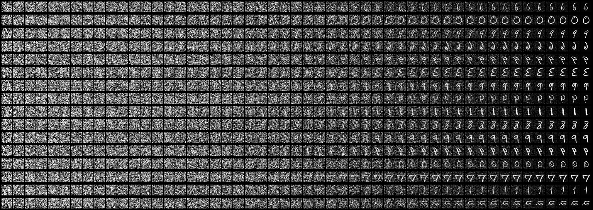
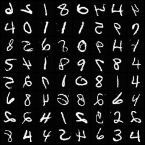
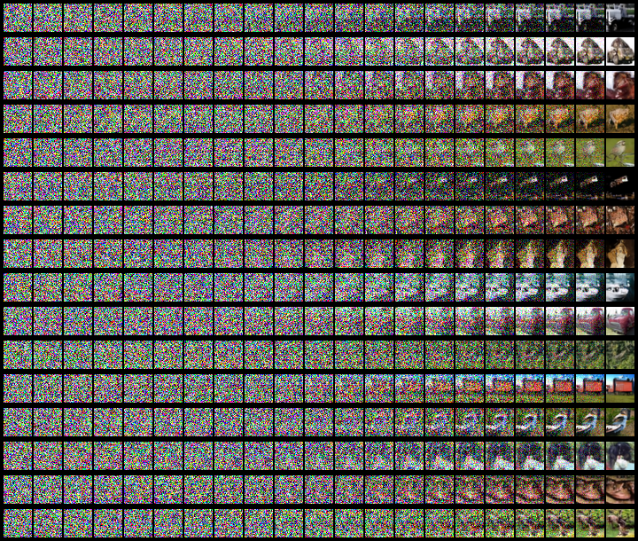
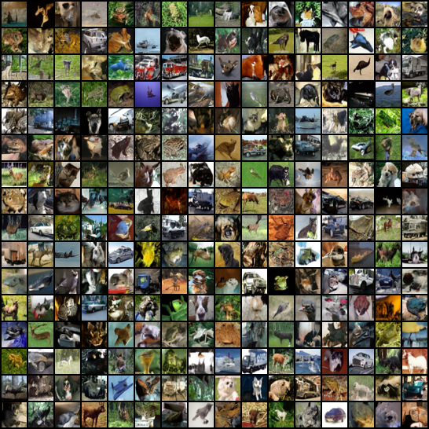

## Denoising Diffusion Implicit Models

This is a pytorch implementation of DDIM. The original paper is here https://arxiv.org/abs/2010.02502 .

This code is almost identical to DDPM, see here: https://github.com/Alokia/diffusion-DDPM-pytorch

## how to use

Almost all the parameters that can be modified are listed in the `config.yml` file. You can modify the relevant parameters as needed, and then run the `train.py` file to start training.

After training, run the `generate.py` file to generate the results. These are the parameters of `generate.py` :

* `-cp` : the path of checkpoint.
* `--device` : device used. `'cuda'` (default) or `'cpu'`.
* `--sampler` : sampler method, can be `'ddpm'`(default) or `'ddim'`.
* `-bs` : how many images to generate at once. Default  `16`.
* `--result_only` : whether to output only the generated results. Default  `False`.
* `--interval` : extract an image every how many steps. Only valid without the `result_only` parameter. Default  `50`.
* `--eta` : ddim parameter, $\eta$  in the paper. Default `0.0`.
* `--steps` : ddim sampling steps. Default `100`.
* `--method` : ddim sampling method. can be `'linear'`(default) or `'quadratic'`.
* `--nrow` : how many images are displayed in a row. Only valid with the `result_only` parameter. Default  `4`.
* `--show` : whether to display the result image. Default  `False`.
* `-sp` : save path of the result image. Default  `None`.
* `--to_grayscale` : convert images to grayscale. Default  `False`.


## Some generated images

* MNIST，[click to download checkpoint](https://drive.google.com/file/d/1gwhczBWOjUtw4Fz_y2PidyKnrUsMSN8t/view?usp=drive_link)

```shell
python generate.py -cp "checkpoint/mnist.pth" -bs 16 --interval 3 --show -sp
"data/result/mnist_sampler.png" --sampler "ddim" --steps 50
```




```shell
python generate.py -cp "checkpoint/mnist.pth" -bs 256 --show -sp "data/result/mnist_result.png" --nrow 16 --result_only --sampler "ddim" --steps 50
```



* CIFAR10, [click to download checkpoint](https://drive.google.com/file/d/1GRVfLSfjGtEPJzxg52k4wj4w2TKk-utO/view?usp=drive_link)

```shell
python generate.py -cp "checkpoint/cifar10.pth" -bs 16 --interval 10 --show -sp "data/result/cifar10_sampler.png" --sampler "ddim" --steps 200 --method "quadratic"
```



```shell
python generate.py -cp "checkpoint/cifar10.pth" -bs 256 --show -sp "data/result/cifar10_result.png" --nrow 16 --result_only --sampler "ddim" --steps 200 --method "quadratic"
```



